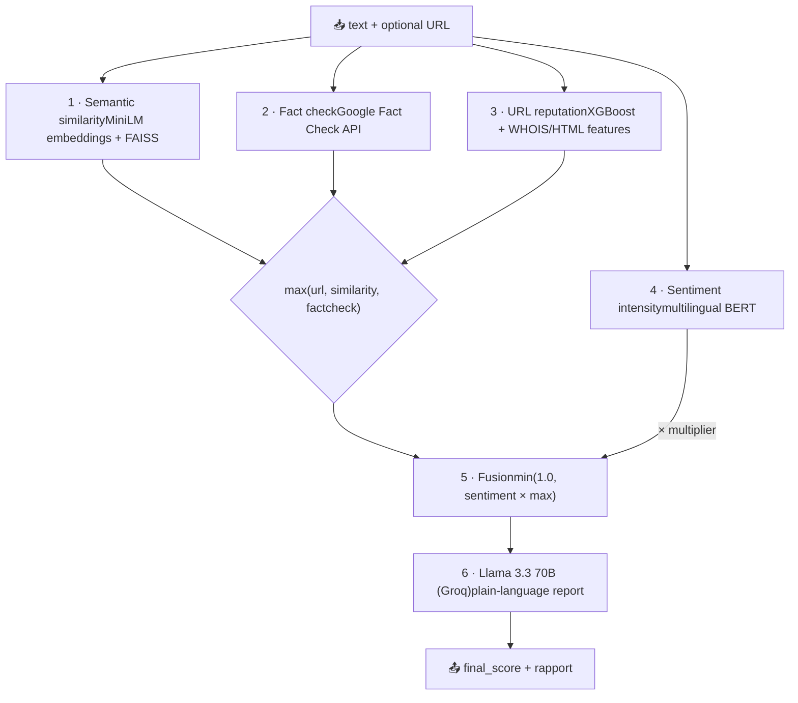

# 🛡️ Anti-Ta7ayol — Tunisian Dialect Scam & Disinformation Detector

> **ta7ayol** (تحيّل): Tunisian Arabic slang for *scamming / conning someone*.

Anti-Ta7ayol is a multi-signal fraud-detection pipeline tuned for **Tunisian dialect (Derja)**, shipped as a **Chrome extension** backed by a **FastAPI** service. Highlight any suspicious message, post, SMS, or URL in your browser and get back a fraud probability score plus a plain-language explanation of *why* it looks like a scam.

Most off-the-shelf scam detectors choke on Tunisian Arabic — code-switched Derja, Arabizi (Latin-script Arabic like `andek forset reb7 kbira`), French, and MSA all mixed in one sentence. This project fuses several weak signals into one verdict instead of betting everything on a single model.

---

## ✨ What it does

- **Text scam detection** — semantic similarity against a curated corpus of Tunisian scam phrases, fused with fact-checking, URL reputation, and sentiment intensity.
- **Phishing URL analysis** — extracts 20+ lexical, WHOIS, and page-content features and scores them with a trained XGBoost classifier.
- **Fact-checking** — cross-references claims against the Google Fact Check Tools API.
- **OCR** — pulls text out of screenshots (Arabic + English + French) so you can check scammy images.
- **Speech-to-text** — transcribes voice notes (a very common scam vector on Tunisian messaging apps).
- **AI media detection** — flags AI-generated / forged images and videos.
- **LLM verdict** — a Llama 3.3 model turns the raw score into a short human-readable report.

---

## 🏗️ Architecture

```mermaid
flowchart LR
    subgraph EXT["🧩 Chrome Extension (MV3)"]
        direction TB
        C["content.js — capture"]
        B["background.js — events"]
        P["popup — React UI"]
    end

    subgraph API["⚙️ FastAPI Backend"]
        direction TB
        CL["/classify — text + URL fusion pipeline"]
        OC["/ocr — image → text (Tesseract)"]
        TR["/transcribe — audio → text (Vosk)"]
        AI["/ai_image — SigLIP image classifier"]
        AV["/ai_video — SigLIP frame sampler"]
        H["/health — liveness probe"]
    end

    EXT -- "HTTP request" --> API
    API -- "score + report" --> EXT
```



### The `/classify` fusion pipeline



Each incoming text (and optional URL) is scored by several independent signals, then combined:

| Step | Signal                  | How it works                                                                                                                                                             |
| ---- | ----------------------- | ------------------------------------------------------------------------------------------------------------------------------------------------------------------------ |
| 1    | **Semantic similarity** | The text is embedded with `paraphrase-multilingual-MiniLM-L12-v2` and matched against a FAISS index of known Tunisian scam phrases (cosine / inner-product).             |
| 2    | **Fact check**          | The claim is sent to the Google Fact Check Tools API; matching verdicts (TF-IDF similarity ≥ threshold) push the score up or down.                                       |
| 3    | **URL reputation**      | If a URL is present, 20+ features (length, digit ratios, phishing keywords, domain age via WHOIS, page hyperlinks, title checks…) feed a trained XGBoost phishing model. |
| 4    | **Sentiment intensity** | A multilingual BERT sentiment model acts as a *multiplier* — extreme tone (1★ panic / 5★ "you won!") is a classic scam tell, so it amplifies the base score.             |
| 5    | **Fusion**              | `final_score = min(1.0, sentiment_factor × max(url, similarity, factcheck))`                                                                                             |
| 6    | **Explanation**         | The score + original text go to **Llama 3.3 70B** (via Groq) which returns a short English report describing whether it looks fraudulent and why.                        |

---

## 🧠 Models & tech

| Component               | Model / Library                                               |
| ----------------------- | ------------------------------------------------------------- |
| Sentence embeddings     | `sentence-transformers/paraphrase-multilingual-MiniLM-L12-v2` |
| Vector search           | FAISS (`IndexHNSWFlat`, inner product)                        |
| Phishing URL classifier | XGBoost + scikit-learn scaler                                 |
| Sentiment               | `nlptown/bert-base-multilingual-uncased-sentiment`            |
| Fact checking           | Google Fact Check Tools API                                   |
| LLM report              | `llama-3.3-70b-versatile` (Groq API)                          |
| OCR                     | Tesseract (`pytesseract`, `ara+eng+fra`)                      |
| Speech-to-text          | Vosk                                                          |
| AI image/video          | `Ateeqq/ai-vs-human-image-detector` (SigLIP)                  |
| API                     | FastAPI + Uvicorn                                             |
| Frontend                | Chrome Extension Manifest V3, React popup                     |

---

## 📁 Project structure

```
anti_ta7ayol/
├── backend/
│   ├── main.py                     # FastAPI app, loads models & wires routers
│   ├── requirements.txt
│   ├── data/
│   │   └── tunisian_scam_phrases.txt   # ~289 curated scam phrases (Derja + Arabizi + FR)
│   ├── scam_index.faiss            # prebuilt FAISS index
│   ├── scam_metadata.pkl           # phrase metadata
│   └── src/
│       ├── routers/                # classify, ocr, voice, health, ai_image, ai_video
│       └── services/
│           ├── similarity_check/   # embeddings + FAISS vector DB
│           ├── url_enrichment/     # XGBoost phishing model + feature extraction
│           ├── fact_check/         # Google Fact Check integration
│           ├── sentiment_analysis/ # multilingual BERT sentiment
│           ├── LLM_response/       # Groq / Llama report generation
│           ├── image_text_extraction/  # Tesseract OCR
│           ├── speech_to_text/     # Vosk transcription
│           └── image_video_detection/  # SigLIP AI-media detection
├── frontend/
│   └── scam_detector/              # Chrome extension (MV3)
│       ├── manifest.json
│       ├── content.js              # text capture (selection, Ctrl+Shift+S)
│       ├── background.js           # context menu / service worker
│       ├── popup.html / popup.js   # React analysis UI
│       └── icons/
└── render.yaml                     # Render.com deploy config
```

---

## 🚀 Getting started

### Prerequisites

- Python 3.10+
- [Tesseract OCR](https://github.com/tesseract-ocr/tesseract) with Arabic & French language packs
- A [Vosk model](https://alphacephei.com/vosk/models) (placed at `backend/models/vosk-model`)
- A **Groq API key** and a **Google Fact Check API key**

### 1. Backend

```bash
cd backend
python -m venv .venv && source .venv/bin/activate
pip install -r requirements.txt
```

Create a `.env` file in `backend/`:

```env
GROQ_API_KEY=your_groq_key_here
```

> **Heads-up on the Google Fact Check key:** the current code has the key hardcoded in `src/services/fact_check/processor.py`. Move it into your `.env` and read it with `os.getenv(...)` before pushing anywhere public — committed keys get scraped and revoked fast.

Download the model assets the services expect under `backend/models/`:

- `models/sentence_transformer` — saved sentence-transformer (see `similarity_check/model.py`, run it once with a save path to generate)
- `models/phishing model` — `final_phishing_model.pkl` + `scaler.pkl`
- `models/vosk-model` — a Vosk speech model

Then run:

```bash
uvicorn main:app --reload --port 8000
```

The FAISS index builds automatically from `tunisian_scam_phrases.txt` on first launch if it isn't already present.

### 2. Chrome extension

1. Open `chrome://extensions`
2. Enable **Developer mode**
3. Click **Load unpacked** and select `frontend/scam_detector/`
4. Point the extension at your backend URL (localhost during dev)

---

## 🔌 API reference

| Method | Endpoint       | Body                           | Returns                                                  |
| ------ | -------------- | ------------------------------ | -------------------------------------------------------- |
| `POST` | `/classify/`   | `{ "text": str, "url": str? }` | `{ "rapport": str, "final_score": float }` (score 0–100) |
| `POST` | `/ocr/`        | `multipart` image file         | `{ "text": str, "file_name": str }`                      |
| `POST` | `/transcribe/` | `multipart` WAV (mono PCM)     | `{ "text": str, "file_name": str }`                      |
| `POST` | `/ai_image/`   | `multipart` image file         | `{ "ai_score": float, "file_name": str }`                |
| `POST` | `/ai_video/`   | `multipart` video file         | `{ "ai_score": 0\|1, "file_name": str }`                 |
| `GET`  | `/health/`     | —                              | `{ "status": "ok", "version": "1.0.0" }`                 |

**Example**

```bash
curl -X POST http://localhost:8000/classify/ \
  -H "Content-Type: application/json" \
  -d '{"text": "rabe7t iPhone, click houni bech ta5edh jeyztek", "url": "http://win-prize.xyz"}'
```

---

## 🎯 How to use it

1. Browse normally.
2. Select a suspicious message, post, or SMS.
3. Either press **Ctrl/⌘ + Shift + S** or use the right-click menu, then open the extension.
4. Get a fraud score and a short explanation of the red flags.

You can also feed it screenshots (OCR) or voice notes (transcription) for the same analysis.

---

## ⚠️ Notes & limitations

- **Not a guarantee.** The score is a heuristic from imperfect signals — treat it as a second opinion, not a verdict. Stay skeptical regardless of what it says.
- **Hardcoded API key.** As noted above, the Google Fact Check key currently lives in source. Rotate it and move it to env vars.
- **CORS is wide open** (`allow_origins=["*"]`) for development. Lock it to your extension ID before any public deployment.
- **Model assets aren't bundled** — you must supply the sentence-transformer, phishing model, and Vosk model directories.
- The scam-phrase corpus is small (~289 entries). Detection improves a lot as you add more real Derja examples via `VectorDB.add_phrases(...)`.

---

## 🛣️ Possible next steps

- Fine-tune a dedicated Derja/Arabizi scam classifier instead of relying on generic multilingual embeddings.
- Expand and crowdsource the scam-phrase corpus.
- Move all secrets to environment variables / a secrets manager.
- Add a feedback loop so users can flag false positives/negatives to grow the dataset.
- Confidence calibration so the 0–100 score maps to actual likelihood.
